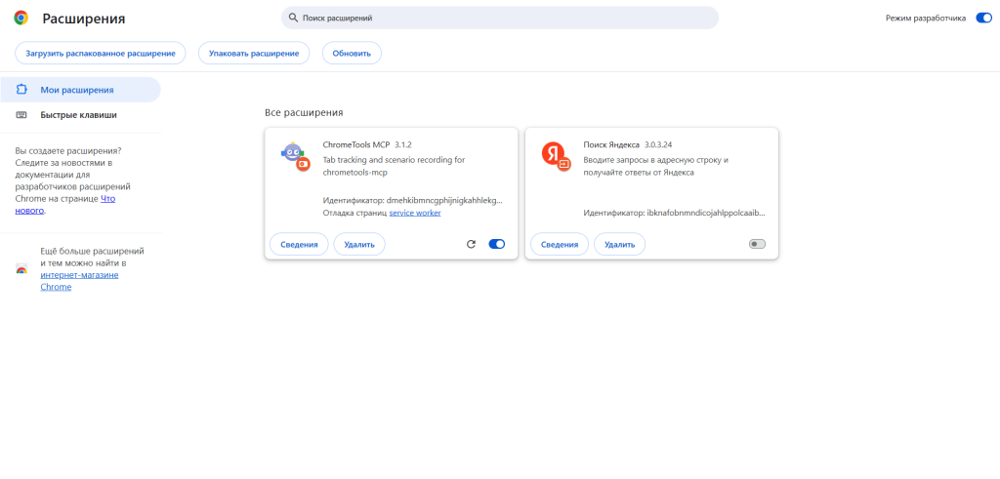

# chrometools-mcp

MCP сервер для автоматизации Chrome с использованием Puppeteer и постоянными сессиями браузера.

[English version](README.md)

## Установка

### Claude Code (CLI)

Самый простой способ установки для пользователей Claude Code:

```bash
claude mcp add chrometools -- npx chrometools-mcp
```

Эта команда автоматически настроит MCP сервер в настройках Claude Code.

### Claude Desktop

Добавьте в конфигурационный файл Claude Desktop:

**macOS/Linux:** `~/Library/Application Support/Claude/claude_desktop_config.json`
**Windows:** `%APPDATA%\Claude\claude_desktop_config.json`

```json
{
  "mcpServers": {
    "chrometools": {
      "command": "npx",
      "args": ["chrometools-mcp"]
    }
  }
}
```

### Cursor

**Шаг 1:** Откройте настройки MCP в Cursor
- Нажмите на **Settings** (⚙️ иконка или `Cmd + ,` / `Ctrl + ,`)
- Перейдите в **Cursor Settings** → **MCP**

**Шаг 2:** Отредактируйте конфигурацию MCP
- Добавьте `chrometools` в объект `mcpServers`:

```json
{
  "mcpServers": {
    "chrometools": {
      "command": "npx",
      "args": ["chrometools-mcp"]
    }
  }
}
```

**Шаг 3:** Сохраните и перезапустите
- Сохраните конфигурационный файл
- Перезапустите Cursor для применения изменений

**Шаг 4:** Протестируйте установку
- Откройте Cursor Chat
- Выберите режим **Agent**
- Попробуйте команду: "Open browser and navigate to google.com"

### Ручная установка

Вы также можете запустить напрямую без конфигурации:

```bash
npx chrometools-mcp
```

### Настройка расширения Chrome

Расширение Chrome **необходимо** для записи сценариев и других расширенных функций. Следуйте этим шагам для установки:

**Важно:** ChromeTools открывает Chrome с отдельным профилем пользователя, поэтому вы должны установить расширение **после** первого запуска Chrome через ChromeTools.

**Шаг 1:** Сначала запустите MCP сервер ChromeTools
- Убедитесь, что ChromeTools запущен через ваш MCP клиент (Claude Desktop, Cursor и т.д.)
- Или запустите вручную: `npx chrometools-mcp`
- Это запустит Chrome с изолированным профилем ChromeTools

**Шаг 2:** Включите режим разработчика в Chrome
- Откройте страницу расширений Chrome: `chrome://extensions`
- Переключите **Режим разработчика** (переключатель в правом верхнем углу)



**Шаг 3:** Скачайте и распакуйте расширение

**Вариант A - Скачать с GitHub (Рекомендуется):**
1. Скачайте архив расширения: [chrome-extension.zip](https://github.com/modelcontextprotocol/servers/raw/main/src/chrometools/chrome-extension.zip)
2. Распакуйте ZIP файл в папку на вашем компьютере
3. Запомните путь распаковки (он понадобится на следующем шаге)

**Вариант B - Использовать из node_modules (если знаете путь):**
- **После npx установки:** `~/.npm/_npx/.../node_modules/chrometools-mcp/extension`
- **После глобальной установки:** `<npm-global-path>/node_modules/chrometools-mcp/extension`
- **Из исходников:** `<repo-path>/extension`

**Шаг 4:** Загрузите расширение
- Нажмите кнопку **"Загрузить распакованное"** (Load unpacked)
- Перейдите к распакованной папке расширения (из Шага 3)
- Выберите папку и нажмите **"Выбрать папку"**

**Шаг 5:** Проверьте установку
- Вы должны увидеть расширение "ChromeTools MCP" в списке расширений с:
  - **Название:** ChromeTools MCP
  - **Версия:** (текущая версия)
  - **Описание:** MCP server integration for Chrome automation
  - **Статус:** Переключатель должен быть ВКЛЮЧЕН (синий)
- Найдите иконку ChromeTools (CT) в панели инструментов Chrome
- Расширение готово к использованию для записи сценариев


> **Примечание:** После установки карточка расширения появится на странице `chrome://extensions` вместе с другими установленными расширениями. Расширение должно отображаться как "Включено" с синим переключателем.

**Шаг 6:** Закрепите расширение (опционально, но рекомендуется)
- Нажмите на иконку пазла в панели инструментов Chrome
- Найдите "ChromeTools MCP" в списке
- Нажмите на иконку булавки, чтобы оставить его видимым в панели инструментов

**Устранение неполадок:**
- **Рекомендуется:** Используйте Вариант A (скачивание с GitHub), чтобы избежать поиска в node_modules
- Если используете Вариант B и не можете найти папку расширения после установки `npx`, выполните `npm list -g chrometools-mcp` чтобы найти путь установки
- Расширение работает только с экземплярами Chrome, запущенными через ChromeTools
- Если Chrome закрывается и открывается снова, расширение должно остаться загруженным (режим разработчика сохраняется)
- Когда ChromeTools впервые открывает Chrome, он автоматически показывает подсказку с путем к расширению в node_modules

## Оглавление

- [Установка](#установка)
  - [Настройка расширения Chrome](#настройка-расширения-chrome)
- [Возможности оптимизации AI](#возможности-оптимизации-ai)
- [Записывающее устройство сценариев](#записывающее-устройство-сценариев)
- [Доступные инструменты](#доступные-инструменты) - **46+ инструментов всего**
  - [AI-инструменты](#ai-инструменты)
  - [Основные инструменты](#основные-инструменты)
  - [Инструменты взаимодействия](#инструменты-взаимодействия)
  - [Инструменты инспекции](#инструменты-инспекции)
  - [Продвинутые инструменты](#продвинутые-инструменты)
  - [Инструменты управления вкладками](#инструменты-управления-вкладками)
  - [Инструменты записи](#инструменты-записи)
- [Типичный пример рабочего процесса](#типичный-пример-рабочего-процесса)
- [Советы по использованию инструментов](#советы-по-использованию-инструментов)
- [Конфигурация](#конфигурация)
- [Поддержка нескольких экземпляров](#поддержка-нескольких-экземпляров)

## Возможности оптимизации AI

Значительно сокращайте циклы запросов AI-агента с помощью интеллектуального поиска элементов и анализа страниц.

### Основные возможности:

- **analyzePage**: Возвращает структурированную модель страницы с уникальными ID элементов
- **smartFindElement**: Находит элементы по естественному языковому описанию
- **getElementDetails**: Получает детальную информацию о конкретном элементе
- **findElementsByText**: Находит элементы по видимому тексту

## Записывающее устройство сценариев

Визуальный UI-рекордер для создания переиспользуемых тестовых сценариев с автоматическим обнаружением секретов.

### Основные возможности:

- **Визуальный UI** - Используйте расширение Chrome для записи
- **Умная оптимизация** - Автоматически находит родительские элементы с обработчиками событий
- **Обнаружение секретов** - Автоматически определяет пароли, токены, ключи API
- **Умные ожидания** - 2 секунды минимум + обнаружение анимации/сети/изменений DOM
- **Генерация кода** - Экспортирует в Playwright/Selenium

## Доступные инструменты

### AI-инструменты

- `analyzePage` - Анализирует структуру страницы и возвращает модель с уникальными ID
- `smartFindElement` - Находит элементы по описанию на естественном языке
- `getElementDetails` - Получает детальную информацию о элементе
- `findElementsByText` - Находит элементы по видимому тексту
- `getAllInteractiveElements` - Получает все интерактивные элементы с селекторами

### Основные инструменты

- `ping` - Тестовая команда для проверки связи
- `openBrowser` - Открывает браузер и переходит по URL

### Инструменты взаимодействия

- `click` - Кликает по элементу
- `type` - Вводит текст в поле ввода
- `scrollTo` - Прокручивает к элементу
- `selectOption` - Выбирает опцию из выпадающего списка
- `selectFromGroup` - Выбирает из радио-кнопок или чекбоксов
- `drag` - Перетаскивает элемент мышью
- `scrollHorizontal` - Горизонтальная прокрутка элемента

### Инструменты инспекции

- `getElement` - Получает HTML-разметку элемента
- `getComputedCss` - Получает вычисленные CSS стили
- `getBoxModel` - Получает box model элемента (размеры, отступы)
- `screenshot` - Делает скриншот элемента или страницы
- `saveScreenshot` - Сохраняет скриншот в файл

### Продвинутые инструменты

- `executeScript` - Выполняет JavaScript код
- `getConsoleLogs` - Получает логи консоли браузера
- `listNetworkRequests` - Список сетевых запросов
- `getNetworkRequest` - Детали конкретного запроса
- `filterNetworkRequests` - Фильтрует запросы по URL
- `hover` - Наводит курсор на элемент
- `setStyles` - Применяет inline CSS стили
- `setViewport` - Изменяет размер окна браузера
- `getViewport` - Получает размер окна браузера
- `navigateTo` - Переходит по новому URL

### Инструменты управления вкладками

- `listTabs` - Список всех открытых вкладок
- `switchTab` - Переключается на другую вкладку

### Инструменты записи

- `enableRecorder` - Проверяет статус рекордера
- `startRecording` - Начинает запись действий
- `stopRecording` - Останавливает запись
- `saveScenario` - Сохраняет записанный сценарий
- `executeScenario` - Выполняет сохраненный сценарий
- `listScenarios` - Список всех сценариев
- `searchScenarios` - Поиск сценариев
- `getScenarioInfo` - Детали сценария
- `deleteScenario` - Удаляет сценарий
- `exportScenarioAsCode` - Экспортирует сценарий в код теста
- `appendScenarioToFile` - Добавляет сценарий в существующий файл
- `generatePageObject` - Генерирует Page Object Model

## Типичный пример рабочего процесса

```javascript
// 1. Открыть браузер
openBrowser({ url: "https://example.com" })

// 2. Проанализировать страницу
analyzePage()
// Возвращает структурированную модель с ID элементов

// 3. Взаимодействовать с элементами по ID
click({ id: "button_45" })
type({ id: "input_20", text: "Hello World" })

// 4. Обновить анализ после изменений
analyzePage({ refresh: true })

// 5. Получить детали конкретного элемента
getElementDetails({ id: "form_15" })
```

## Советы по использованию инструментов

1. **Используйте analyzePage часто** - Это самый эффективный способ понять состояние страницы
2. **Используйте ID элементов** - После analyzePage используйте ID (например, `button_45`) вместо CSS селекторов
3. **Обновляйте после изменений** - Используйте `analyzePage({ refresh: true })` после кликов/отправок форм
4. **Предпочитайте click/type вместо executeScript** - Они правильно работают с фреймворками
5. **Используйте saveScreenshot для Telegram** - Вместо screenshot для отправки изображений

## Конфигурация

### Переменные окружения

- `DEBUG_MODE=true` - Включает детальное логирование
- `CHROME_PATH=/path/to/chrome` - Путь к Chrome (опционально)

### Файл конфигурации

Создайте `.chrometools.json` в домашней директории:

```json
{
  "debugMode": false,
  "chromePath": null,
  "userDataDir": null
}
```

## Поддержка нескольких экземпляров

Запускайте до 8 MCP серверов одновременно, подключайтесь/отключайтесь в любое время без координации.

### Возможности:

- **Динамическое выделение портов** (9223-9227)
- **Автоматическое обнаружение** расширением Chrome
- **Широковещательный паттерн** для параллельных AI клиентов
- **Плавная обработка** неожиданных завершений

### Использование:

Просто запустите несколько экземпляров:

```bash
# Терминал 1
npx chrometools-mcp

# Терминал 2
npx chrometools-mcp

# Терминал 3
npx chrometools-mcp
```

Каждый экземпляр автоматически найдет свободный порт и подключится к расширению Chrome.

## Особенности

- **Постоянные сессии браузера** - Вкладки остаются открытыми между запросами
- **Визуальный браузер (GUI режим)** - Видите автоматизацию в реальном времени
- **Кроссплатформенность** - Работает на Windows/WSL, Linux, macOS
- **Простая установка** - Одна команда с npx
- **Интеграция CDP** - Использует Chrome DevTools Protocol для точности
- **Дружелюбен к AI** - Детальные описания оптимизированы для AI агентов

## Лицензия

MIT

## Поддержка

Для вопросов и сообщений об ошибках создайте issue на GitHub.
